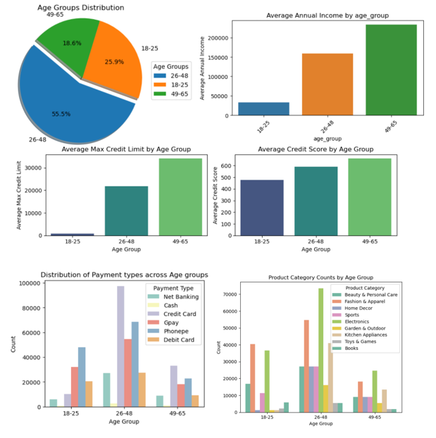

# 💳 Credit Card Launch EDA — Target Segment Analysis & Campaign Validation

> End-to-end data analysis project for a bank planning to launch a new credit card. Used Exploratory Data Analysis to identify the right target customer segment, then applied hypothesis testing and A/B testing to validate the marketing campaign's effectiveness on that segment.

    

---

## 🎯 Business Problem

A bank planned to launch a new credit card targeted at customers who are **underserved by existing credit products**. The analysis answered two critical questions:

1. **Who is the right target segment for this card?**
2. **Did the trial campaign actually drive measurable behaviour change in that segment?**

---

## 📊 Dataset Overview

Built on a real banking dataset spread across 4 linked tables:

| Table | Records | Key Columns |
|-------|---------|-------------|
| `customers` | 1,000 | cust_id, name, gender, age, location, occupation, annual_income, marital_status |
| `transactions` | 50,000 | trans_id, cust_id, tran_date, tran_amount, product_category, payment_type |
| `credit_profiles` | 1,000 | cust_id, credit_score, credit_utilisation, outstanding_debit, credit_limit |
| `avg_transactions_after_campaign` | Campaign data | campaign_date, control_group_avg_tran, test_group_avg_tran |

---

## 🔍 Project Workflow

```
Phase 1: Identify Target Segment (Notebook 1)
        ↓
EDA on demographics, credit profile, and spending behaviour
        ↓
Selected 18–25 age group as primary target
        ↓
Phase 2: Validate Campaign Impact (Notebook 2)
        ↓
Hypothesis Testing + A/B Testing
        ↓
Recommendation to bank
```

---

## 📓 Notebook 1 — Customer Segmentation EDA

**Goal:** Find the right target customer group for the new credit card.

**Analysis covered:**
- Customer demographics — age, gender, location, occupation, income
- Credit profile patterns — credit score, credit utilisation, credit limit
- Transaction behaviour — payment types, product categories, spending levels

**Key findings:**
- The **18–25 age group accounts for ~26% of the customer base** — a sizable underserved segment
- Average annual income of this group is **less than ₹50K**, indicating limited financial history
- Low credit scores and credit limits reflect **lack of credit history**, not creditworthiness
- **Credit card usage is significantly lower** in this segment compared to other age groups
- Top 3 shopping categories — **Electronics, Fashion & Apparel, Beauty & Personal Care** — perfect categories for targeted credit card rewards

**Conclusion:** The 18–25 age group was identified as the **ideal target market** for a trial credit card launch — they have spending potential but lack credit access, making them an underserved high-opportunity segment.

---
### 📊 Visual Findings — Target Segment Profile



This dashboard visualises why the 18–25 age group emerged as the ideal target — sizable customer base (~26%) with low income, limited credit history, low credit card usage, and clear spending preferences in Electronics, Fashion, and Beauty categories.

---

## 📓 Notebook 2 — Hypothesis Testing & A/B Testing

**Goal:** Validate whether the trial credit card campaign actually changed customer spending behaviour in the target segment.

**Analysis covered:**
- **Hypothesis testing** to statistically verify assumptions about customer spending changes
- **A/B testing** comparing a **control group** (no campaign) vs a **test group** (received campaign)
- Pre-campaign vs post-campaign transaction analysis
- Statistical significance of campaign effectiveness

**Outcome:** Data-driven evidence on whether the campaign should be scaled to the full target segment or refined further before broader rollout.

---

## 💡 Business Value Delivered

- Identified a **high-opportunity underserved segment** (18–25 age group, ~26% of base)
- Mapped segment characteristics to a tailored credit card product
- Provided **statistical validation** of campaign effectiveness before full rollout
- Translated raw data into actionable recommendations for marketing and product teams

---

## 🛠 Tech Stack

| Category | Tools |
|----------|-------|
| Language | Python 3.10+ |
| Data Manipulation | Pandas, NumPy |
| Visualisation | Matplotlib, Seaborn |
| Statistics | SciPy (Hypothesis & A/B Testing) |
| Environment | Jupyter Notebook |

---

## 🚀 How to Run

**1. Clone the repository**
```bash
git clone https://github.com/juliet3-lab/credit-card-launch-eda.git
cd credit-card-launch-eda
```

**2. Install dependencies**
```bash
pip install pandas numpy matplotlib seaborn scipy jupyter
```
---
**3. Unzip the dataset files**

Some files are zipped due to GitHub's 25MB upload limit:
- Unzip `transactions.zip` to get `transactions.csv`
- Unzip `e_master_card_dump.zip` to get the MySQL dump file
---

**4. Launch the notebooks in order**
```bash
jupyter notebook
```
- Run `Phase_1_customer_segmentation_eda.ipynb` first to understand the target segment selection
- Then run `Phase_2_hypothesis_ab_testing.ipynb` to see the campaign validation analysis

----

## 📁 Project Structure

```
├── Phase_1_customer_segmentation_eda.ipynb
├── Phase_2_hypothesis_ab_testing.ipynb
├── target_segment_analysis.png 
├── .gitignore
├── README.md
├── customers.csv
├── transactions.zip        # Unzip before running notebook (50K rows)
├── credit_profiles.csv
├── avg_transactions_after_campaign.csv
└── e_master_card_dump.zip  # Unzip to get MySQL dump file
```

---

## 🔮 What's Next

- [ ] Build a classification model to predict which customers in the 18–25 segment are most likely to adopt the card
- [ ] Create an interactive Streamlit dashboard for segment exploration
- [ ] Extend A/B testing to multi-variant campaign analysis across additional segments

---

## 👤 Author

**Florence Arul Juliet** — Banking Domain Professional transitioning into Data Science & AI

- 💼 3.7 years in BFSI · Fraud Detection · Transaction Analysis

---

## 📜 License

This project is open source and available under the MIT License.
